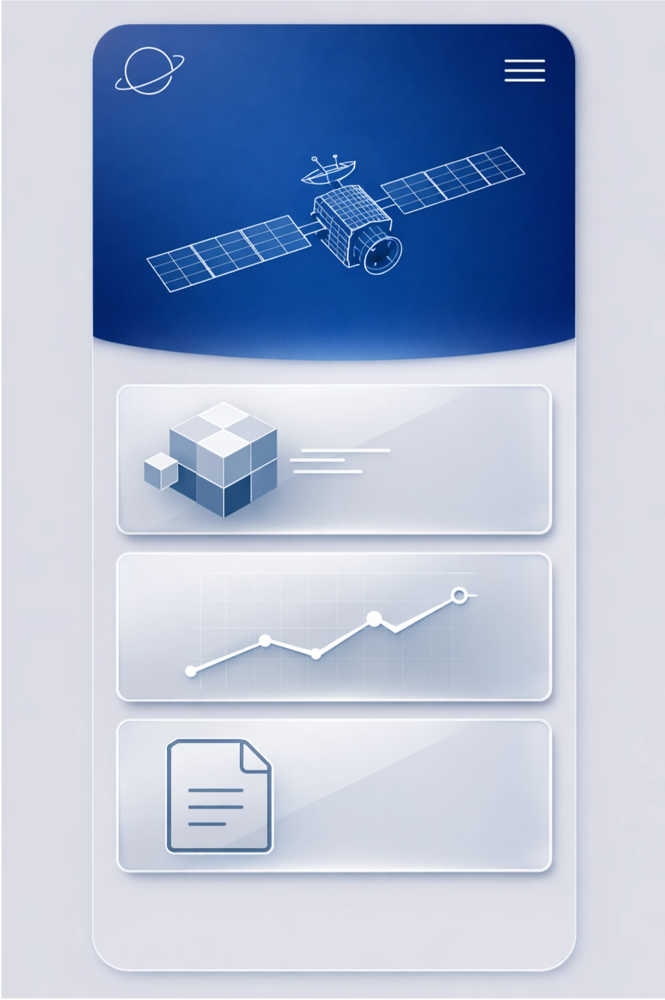

<div align="center"> 
 
 <h1 style="margin: 30px 0 30px; font-weight: bold;">SpaceMV-CoAI-Wp-Mobile-Frontend: Industrial Planet Operations AI Agent's SpaceMV-CoAI-Wp (Enterprise Official Website) React Frontend (Mobile)</h1> 
 
 <a href="./LICENSE"></a> <a href="https://github.com/tianxunweixiao/SpaceMV-CoAI-Wp-Mobile-Frontend"></a> <a href="https://github.com/vitejs/vite/actions/workflows/ci.yml"></a> 
 
 </div> 
 
 <div align="center"> 
 
 <a href="./README.md"><strong>简体中文</strong></a> | <a href="./README_EN.md"><strong>English</strong></a> 
 
 </div> 
 
 &nbsp;&nbsp; 
 
 <div align="center"> 
 
  
 
 </div>

[SpaceMV-CoAI-Wp-Mobile-Frontend](https://github.com/tianxunweixiao/SpaceMV-CoAI-Wp-Mobile-Frontend/tree/main) is an Industrial Planet Operations AI Agent's SpaceMV-CoAI-Wp (Enterprise Official Website) mobile display project developed by Chengdu Tianxun Micro Satellite Technology Co., Ltd. As the mobile frontend display component of the SpaceMV-CoAI-Wp (Enterprise Official Website) module in the SpaceMV-CoAI Industrial Planet Operations AI Agent, it is responsible for presenting the SpaceMV-CoAI-Wp (Enterprise Official Website) content managed in the backend in a modern, responsive manner, achieving real-time synchronized display of SpaceMV-CoAI-Wp (Enterprise Official Website) content.

[SpaceMV-CoAI-Wp-Mobile-Frontend](https://github.com/tianxunweixiao/SpaceMV-CoAI-Wp-Mobile-Frontend/tree/main), as an Industrial Planet Operations AI Agent's SpaceMV-CoAI-Wp (Enterprise Official Website) mobile display system, features responsive layout, real-time content synchronization display functionality, which can present the SpaceMV-CoAI-Wp (Enterprise Official Website) content managed in the backend in a modern, aesthetically pleasing way, and supports multi-device adaptation. It also provides a smooth browsing experience for visitors through optimized loading performance, helping to enhance brand image and user conversion rates.

`SpaceMV-CoAI-Wp-Mobile-Frontend`, as an Industrial Planet Operations AI Agent's SpaceMV-CoAI-Wp (Enterprise Official Website) mobile frontend display system, assumes key functions such as modern presentation of SpaceMV-CoAI-Wp (Enterprise Official Website) content, responsive layout adaptation, and multi-device access optimization.

## **Table of Contents**

* [Core Modules](#core-modules)
* [Technical Architecture](#technical-architecture)
* [Features](#features)
* [Quick Start](#quick-start)
* [Contribution Guidelines](#contribution-guidelines)
* [License](#license)
* [Contact Information](#contact-information)
* [Todo List](#todo-list)

## Core Modules
~~~
SpaceMV-CoAI-Wp-Mobile-Frontend/
├── Core Framework Layer
│   ├── Routing Management        // Responsible for page routing configuration, using React Router
│   ├── State Management          // Manages application global state, using Redux Toolkit
│   ├── Service Configuration     // Configures axios request interceptors and response handling
├── Business Module Layer
│   ├── Home Page Module          // Displays company homepage content, including carousel, product display, etc.
│   ├── About Us Module           // Displays company introduction, product certification, etc.
│   ├── Product One Module        // Displays content related to Product One
│   ├── News Center Module        // Displays company news and industry information
│   └── Product Two Module        // Displays products and solutions related to Product Two
├── Component Layer
│   ├── Carousel Component        // Implements homepage carousel functionality
│   ├── Contact Us Component      // Displays contact information and map
│   ├── Footer Component          // Displays website bottom information
│   ├── Header Component          // Displays website navigation bar and Logo
│   ├── Icon Font Component       // Provides icon font support
│   └── Toast Component           // Implements global message prompt functionality
├── API Interface Layer
│   ├── Company Interface         // Gets company-related information
│   ├── Main Page Interface       // Gets homepage display content
│   ├── Product Interface         // Gets product-related information
│   └── Top Button Interface      // Gets top button configuration
└── Resource Layer
    ├── Static Resources          // Static files such as images, icons, etc.
    └── Style Files               // Global styles and theme configuration
~~~

## Technical Architecture

### Directory Structure

SpaceMV-CoAI-Wp-Mobile-Frontend/  
├── public/                   \# Public resources  
│   ├── about/                \# About us page static resources  
│   ├── header/               \# Header component static resources  
│   ├── news/                 \# News center page static resources   
│  
├── src/                      \# Source code directory  
│   ├── api/                  \# API interfaces  
│   │   ├── company/          \# Company-related interfaces  
│   │   ├── mainPage/         \# Main page-related interfaces  
│   │   ├── product/          \# Product-related interfaces  
│   │   └── topButton/        \# Top button-related interfaces  
│   │  
│   ├── components/           \# Public components  
│   │   ├── carousel/          \# Carousel component  
│   │   ├── contact-us/        \# Contact us component  
│   │   ├── footer/            \# Footer component  
│   │   ├── header/            \# Header component  
│   │   ├── iconfont/          \# Icon font component  
│   │   └── toast/             \# Toast component  
│   │  
│   ├── pages/                \# Page views  
│   │   ├── about-us/          \# About us page  
│   │   ├── home/              \# Home page  
│   │   ├── large-model/       \# Product One page  
│   │   ├── news-center/       \# News center page  
│   │   └── small-device/      \# Product Two page  
│   │  
│   ├── router/               \# Routing configuration  
│   ├── services/             \# Service configuration  
│   │   └── axiosConfig.ts     \# Axios configuration  
│   │  
│   ├── store/                \# State management  
│   │   ├── modules/           \# State management modules  
│   │   │   └── menuReducer/     \# Menu state management  
│   │   └── index.ts           \# State management entry  
│   │  
│   ├── styles/               \# Style files  
│   │   └── theme.less         \# Theme styles  
│   │  
│   ├── App.tsx               \# Root component  
│   ├── index.less            \# Global styles  
│   ├── main.tsx              \# Entry file  
│   └── vite-env.d.ts         \# Vite environment type declaration  
│  
├── .editorconfig             \# Editor configuration  
├── .env                      \# Environment configuration  
├── .env.development          \# Development environment configuration  
├── .env.production           \# Production environment configuration  
├── .eslintignore             \# ESLint ignore file  
├── .eslintrc                 \# ESLint configuration  
├── .gitignore                \# Git ignore file  
├── .npmrc                    \# npm configuration  
├── .prettierignore           \# Prettier ignore file  
├── .prettierrc.cjs           \# Prettier configuration  
├── .stylelintrc.js           \# Stylelint configuration  
├── README.md                 \# Project description  
├── index.html                \# Entry HTML  
├── package.json              \# Project dependencies  
├── tailwind.config.js        \# Tailwind CSS configuration  
├── tsconfig.app.json         \# TypeScript application configuration  
├── tsconfig.json             \# TypeScript configuration  
├── tsconfig.node.json        \# TypeScript Node configuration  
└── vite.config.ts            \# Vite configuration

### Technology Stack

| Domain | Technology Selection | Description |
| :--- | :--- | :--- |
| **Frontend Framework** | **React 19** | Declarative JavaScript library |
| | **TypeScript** | Type-safe JavaScript superset |
| | **React Router** | Official routing manager |
| | **Redux Toolkit** | Efficient state management library |
| | **Redux Persist** | Redux persistent storage |
| | **Ant Design Icons** | Icon library |
| **Styling** | **Less** | CSS preprocessor |
| | **Tailwind CSS** | Utility-first CSS framework |
| | **CSS Modules** | Modular CSS solution |
| | **Normalize.css** | CSS reset styles |
| **Network Request** | **Axios** | Promise-based HTTP client |
| **Build Tools** | **Vite** | Fast frontend build tool |
| | **ESLint** | Code quality inspection tool |
| | **Prettier** | Code formatting tool |
| | **Stylelint** | CSS code quality inspection tool |
| **Tool Library** | **classnames** | CSS class name management tool |

### Data Flow

graph TD  
    A[User Operation] ---|Triggers Event| B[React Component]  
    B ---|Calls API| C[API Interface Layer]  
    C ---|Sends Request| D[Backend Service]  
    D ---|Returns Data| C  
    C ---|Responds Data| B  
    B ---|Updates Local State| E[useState State Management]  
    B ---|Menu State Management| F[Redux Toolkit State Management]  
    E ---|State Change| B  
    F ---|State Change| B  
    B ---|Renders Page| G[User Interface]  
    B ---|Route Navigation| H[React Router]

## Features

### SpaceMV-CoAI-Wp (Enterprise Official Website) Display Module

* **Home Page Display**: Displays company overview, core products and services, carousel, etc.
* **About Us**: Displays company introduction, development history, team introduction, etc.
* **Product One**: Displays content related to Product One, including article lists and classic cases.
* **News Center**: Displays company news and industry information, supports article list browsing.
* **Product Two**: Displays products and solutions related to Product Two.

## Quick Start

### Prerequisites

* **Node.js** (v16.0 or higher)  
* **npm** package manager  
* **Git** version control tool

### 1. Environment Preparation
```bash
# Clone the repository  
git clone https://github.com/tianxunweixiao/SpaceMV-CoAI-Wp-Mobile-Frontend.git   
cd SpaceMV-CoAI-Wp-Mobile-Frontend

# Install dependencies  
npm install
```
### 2. Environment Variable Configuration
```ini
The project already includes the following environment configuration files:

- .env                # Basic environment configuration
- .env.development    # Development environment configuration
- .env.production     # Production environment configuration

If you need to modify the configuration, just edit the configuration file for the corresponding environment.
```
### 3. Start Development Server
```bash
# Start development server  
npm run dev
```

After the development server starts, you can access the project through the browser at `http://localhost:5173`.

### 4. Build Versions

#### 4.1 Build Production Version
```bash
# Build production version  
npm run build
```

After the build is completed, the production version files will be generated in the `dist` directory, and the built dist package should be placed in the ruoyi-ui/dist directory of the code project.

#### 4.2 Build Development Version
```bash
# Build development version  
npm run build:dev
```

### 5. Code Formatting and Inspection
```bash
# Code formatting  
npm run format

# Code quality inspection  
npm run lint
```

### 6. Preview Build Results
```bash
# Preview build results  
npm run preview

```

## Contribution Guidelines

We warmly welcome community developers to participate in the construction of the SpaceMV-CoAI-Wp-Mobile-Frontend project! If you have any improvement suggestions or discover any bugs, please follow the following process:

1. **Fork this repository**: Click the Fork button in the upper right corner to copy the project to your GitHub account.  
2. **Create a branch**: Cut a new branch from the main branch for development.  
   git checkout -b feature/AmazingFeature  
3. **Commit changes**: Ensure code style consistency and write clear Commit Messages.  
   git commit -m 'feat: Add some AmazingFeature'  
4. **Push branch**:  
   git push origin feature/AmazingFeature  
5. **Submit Pull Request**: Initiate a PR on GitHub and describe your changes in detail.

**Development Suggestions**:

* **Code Style**: Follow the project's code style specifications to ensure code readability.
* **Component Design**: When developing new components, ensure component reusability and maintainability.
* **API Calls**: When adding new API calls, follow the existing modular organization method.
* **Style Management**: Use Less variables and mixins, combined with Tailwind CSS utility classes, to ensure style consistency and maintainability.
* **Testing**: Add appropriate test cases for new features to ensure code quality.

## License

This project adopts the MIT license.

Copyright (c) 2026 Chengdu Tianxun Micro Satellite Technology Co., Ltd.

Permission is hereby granted, free of charge, to any person obtaining a copy of
this software and associated documentation files (the "Software"), to deal in
the Software without restriction, including without limitation the rights to
use, copy, modify, merge, publish, distribute, sublicense, and/or sell copies of
the Software, and to permit persons to whom the Software is furnished to do so,
subject to the following conditions:

The above copyright notice and this permission notice shall be included in all
copies or substantial portions of the Software.

THE SOFTWARE IS PROVIDED "AS IS", WITHOUT WARRANTY OF ANY KIND, EXPRESS OR
IMPLIED, INCLUDING BUT NOT LIMITED TO THE WARRANTIES OF MERCHANTABILITY, FITNESS
FOR A PARTICULAR PURPOSE AND NONINFRINGEMENT. IN NO EVENT SHALL THE AUTHORS OR
COPYRIGHT HOLDERS BE LIABLE FOR ANY CLAIM, DAMAGES OR OTHER LIABILITY, WHETHER
IN AN ACTION OF CONTRACT, TORT OR OTHERWISE, ARISING FROM, OUT OF OR IN
CONNECTION WITH THE SOFTWARE OR THE USE OR OTHER DEALINGS IN THE SOFTWARE.

## Contact Information

If you have any questions, suggestions, or business cooperation needs, please contact the project maintenance team.

* **Email**: code@spacemv.com  
* **Issues**: [GitHub Issues](https://github.com/tianxunweixiao/SpaceMV-CoAI-Wp-Mobile-Frontend/issues)

For more information, you can follow the company's WeChat public account:


## Todo List

- [ ] **News Center Upgrade**: Support connecting to open platform interface data
- [ ] **SpaceMV-CoAI-Wp (Enterprise Official Website) Layout Pluginization**: Realize complete customization of SpaceMV-CoAI-Wp (Enterprise Official Website) layout, support plugin import, and editable customization of page layout/style + content